<h1 align="center">Duy Tran</h1>

    
    
    
    

 

<h2 align="center">About Me</h2>

    Full-stack developer focused on building real-world systems, web apps, and infrastructure.

<h2 align="center">Tech Stack</h2>

    
  
  
  
  
  
  
  
  
  
  
  
  
  
  
  
  

    

    

<h2 align="center">Contact Me</h2>

  
  

<!--
**itssduy/itssduy** is a ✨ _special_ ✨ repository because its `README.md` (this file) appears on your GitHub profile.

Here are some ideas to get you started:

- 🔭 I’m currently working on ...
- 🌱 I’m currently learning ...
- 👯 I’m looking to collaborate on ...
- 🤔 I’m looking for help with ...
- 💬 Ask me about ...
- 📫 How to reach me: ...
- 😄 Pronouns: ...
- ⚡ Fun fact: ...
-->
